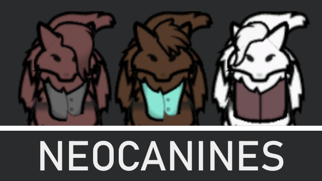

# Neocanines - A race mod for Rimworld



Page @ [Steam Workshop](https://steamcommunity.com/sharedfiles/filedetails/?id=2547207038)

Clone into the `Mods` folder of your installed copy of Rimworld, please note to read **To build from scratch** for the assembly `.dll` as required by this mod. Steam Workshop version comes with one precompiled and ready to use. 

## Dependencies

Requires [Humanoid Alien Races](https://github.com/erdelf/AlienRaces) mod, either cloned into `Mods` folder or by subscription via the Steam Workshop.

## Legacy support

There are no plans to update this mod for versions older than 1.4, but please, feel free to contribute to these versions, such like passing down back-compatible features or changes that you see fit.

## To build from scratch

*This applies only to running Rimworld 1.3 or later.*

This mod has a single C# file required for the special name generation used, so you need to compile the assembly first before you can enjoy the mod. As only the versions published to Steam Workshop will have assemblies ready for use.

This mod has no library dependencies and can just be built straight away without pre-setup requirements taken. Assuming that you already have an development kit for NET 4.7.2 or newer. As for all Rimworld mods, it is required to target `v4.7.2`.

To compile, run this command inside the `Sources/NeocanineSpecials` folder, where the C# project files are located:
```Powershell
dotnet build
```

Or to create a build without debugging info:
```Powershell
dotnet build --configuration Release
```
